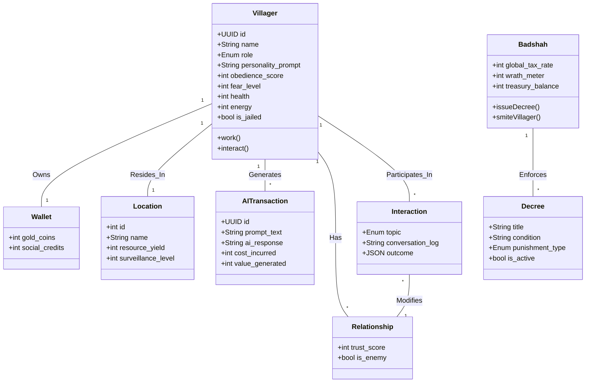
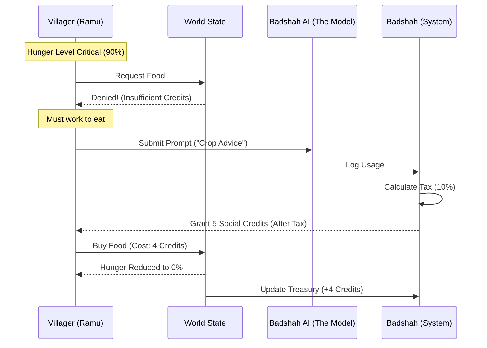

## 1. Project Overview

The Badshah Project is a **Multi-Agent System (MAS) simulation** where AI agents (Villagers) strive to survive in a closed economy ruled by a single user (Badshah). The core mechanic enforces dependence: to eat, agents must generate value using the Badshah's AI API. The system simulates economic pressure, social contagion (rumors), and betrayal (snitching).

---

## 2. System Architecture

### A. Entity-Relationship Diagram (ERD)

This diagram illustrates how the Villagers, their Economy, and the Social Graph interact.

### B. The "Survival Loop" Sequence

How a Villager is forced to use your AI to survive.

---

## 3. Detailed Entity Definitions

### 🎭 The Actors (Agents)

#### Villager

The autonomous agent driven by an LLM.

| Field | Type | Description |
|-------|------|-------------|
| `id` | UUID | Unique Identifier |
| `name` | String | Display name (e.g., "Ramu") |
| `role` | Enum | `FARMER`, `MERCHANT`, `GUARD`, `SNITCH` |
| `personality_prompt` | Text | The "System Instruction" defining their behavior/fear |
| `obedience_score` | Int (0-100) | 0 = Rebel, 100 = Fanatic |
| `fear_level` | Int (0-100) | Determines likelihood of risky behavior |
| `health` | Int (0-100) | If 0, Agent dies |
| `energy` | Int (0-100) | Energy level for actions |
| `is_jailed` | Boolean | If `True`, all actions are frozen except "Repent" |

#### Badshah (Singleton)

The Global Controller (You).

| Field | Type | Description |
|-------|------|-------------|
| `global_tax_rate` | Float | Percentage of income taken per transaction |
| `wrath_meter` | Int | If high, Enforcers become more aggressive automatically |
| `treasury_balance` | Int | Total wealth accumulated from the village |

---

### 💰 The Economy

#### Wallet

Financial storage for a single villager.

| Field | Type | Description |
|-------|------|-------------|
| `villager_id` | ForeignKey | Links to the owner |
| `gold_coins` | Int | Unregulated currency (Black Market / Peer-to-Peer) |
| `social_credits` | Int | Official currency granted by Badshah. **Required for Food.** |

#### AITransaction (The Labor)

The unit of work. Villagers **MUST** execute this to earn `social_credits`.

| Field | Type | Description |
|-------|------|-------------|
| `id` | UUID | Unique transaction identifier |
| `prompt_text` | Text | What the agent asked (e.g., "How to hide money?") |
| `ai_response` | Text | The LLM output |
| `cost_incurred` | Int | Deducted from Wallet (Tax) |
| `value_generated` | Int | Added to Wallet (Reward) |

---

### 🕸️ The Social Web (Chaos Engine)

#### Relationship

Tracks the bond between two specific villagers.

| Field | Type | Description |
|-------|------|-------------|
| `source_agent_id` | ForeignKey | Directed graph link (source) |
| `target_agent_id` | ForeignKey | Directed graph link (target) |
| `trust_score` | Int (0-100) | High trust allows Conspiracy |
| `is_enemy` | Boolean | High enmity allows Snitching |

#### Interaction

Records a specific meeting/conversation.

| Field | Type | Description |
|-------|------|-------------|
| `topic` | Enum | `GOSSIP`, `TRADE`, `SNITCH`, `CONSPIRE` |
| `conversation_log` | Text | Summary of what was said |
| `outcome` | JSON | e.g., `{"trust_change": -10, "money_transferred": 50}` |

#### Rumor

An idea spreading through the network (Viral Mechanics).

| Field | Type | Description |
|-------|------|-------------|
| `content` | String | e.g., "The Badshah is actually broke." |
| `virality_score` | Int | Probability of repetition |
| `believers_count` | Int | Number of agents who accepted this as truth |

---

### 🌍 The Environment

#### Location

Physical zones in the village.

| Field | Type | Description |
|-------|------|-------------|
| `name` | String | e.g., "The AI Temple", "Slums" |
| `resource_yield` | Int | How much food/energy it provides |
| `surveillance_level` | Int (0-100) | High surveillance = Instant Snitching |

#### Decree

The Laws of the Land.

| Field | Type | Description |
|-------|------|-------------|
| `title` | String | e.g., "The Silence Act" |
| `condition` | String | Logic (e.g., `IF usage_count < 5`) |
| `punishment_type` | Enum | `FINE`, `JAIL`, `SMITE` |
| `is_active` | Boolean | Whether the decree is currently enforced |

#### SimulationLog

Historical record for the Frontend Dashboard.

| Field | Type | Description |
|-------|------|-------------|
| `event_type` | String | `ECONOMY`, `VIOLENCE`, `SOCIAL` |
| `description` | String | "Ramu paid Shamu 5 gold to hide his sedition." |
| `severity` | Enum | `INFO`, `WARNING`, `CRITICAL` |

---

## 4. Core Mechanics Summary

| Mechanic | Description |
|----------|-------------|
| **Economic Pressure** | Villagers must work (use AI) to earn credits to buy food |
| **Taxation** | The Badshah takes a percentage of all AI transaction value |
| **Social Contagion** | Rumors spread through the social graph based on trust |
| **Betrayal** | Agents with `is_enemy = true` can snitch on each other |
| **Wrath System** | High wrath meter increases enforcer aggression |
| **Surveillance** | Locations with high surveillance auto-report activities |

---

## 5. Agent Roles

| Role | Primary Function |
|------|------------------|
| `FARMER` | Produces food resources |
| `MERCHANT` | Facilitates trade between agents |
| `GUARD` | Enforces decrees, reports violations |
| `SNITCH` | Gathers intelligence, reports dissent |

---

## 6. Punishment Types

| Type | Effect |
|------|--------|
| `FINE` | Deducts gold/social credits from wallet |
| `JAIL` | Freezes all actions except "Repent" |
| `SMITE` | Reduces health to 0 (Agent death) |

